# Graded Assignment: Jenkins CI/CD Pipeline for Flask App

## 📘 Overview

This repository `Demo-Flask-App-CICD` was created as part of a graded assignment to build a CI/CD pipeline using Jenkins. It demonstrates a complete automation pipeline for testing and deploying a simple Flask-based Python web application.

---

## 🛠 Tech Stack

- **CI/CD Tool**: Jenkins
- **Language**: Python
- **Framework**: Flask
- **Testing Framework**: pytest
- **Cloud Platform**: AWS EC2
- **Notifications**: Email via SMTP
- **Source Control**: GitHub

---

## 🔧 Prerequisites

Before setting up the Jenkins pipeline, ensure the following are configured:
- An AWS EC2 instance with Ubuntu & Instance type as `t2.medium` for faster builds
- Java JDK 17 installed (`sudo apt install openjdk-17-jdk -y`)
- Setup Jenkins ENV using 
   - Add Jenkins GPG key for package authentication
      ```
         curl -fsSL https://pkg.jenkins.io/debian-stable/jenkins.io.key | sudo tee /usr/share/keyrings/jenkins-keyring.asc > /dev/null
      ```
   - Add Jenkins repository to APT sources list
      ```
         echo deb [signed-by=/usr/share/keyrings/jenkins-keyring.asc] https://pkg.jenkins.io/debian-stable binary/ | sudo tee /etc/apt/sources.list.d/jenkins.list > /dev/null
      ```
   - Update system package index
      ```
         sudo apt update
      ```
   - Install Jenkins
      ```
         sudo apt install jenkins -y
      ```
   - Start Jenkins service
      ```
         sudo systemctl start jenkins
      ```
   - Enable Jenkins to start on boot
      ```
         sudo systemctl enable jenkins
      ```
   - Access Jenkins via browser
      ```
         http://<EC2_PUBLIC_IP>:8080
      ```
- Inbound ports 22, 8080 and 3000 allowed in the EC2 security group
- SSH key pair added in Jenkins (as a Credential ID for SSH access)

   > **Note**: Installed `SSH Agent Plugin` 

- Created Gituh Repo and integrated Jenkins
- Email SMTP settings configured in Jenkins
   - Need to create `App Password` in google's `2-Step Verification`
   - Add email id & password into `Jenkins Credentials`
- Necessary Jenkins plugins installed:
   - GitHub Plugin
   - Email Extension Plugin
   - Pipeline
   - SSH Agent Plugin

---

## ✅ Jenkins Pipeline Stages

### 📂 1. Parallel Build Stage
- `Hello` step: Just prints `Hello World` for testing
- `Code Checkout`: Clones the GitHub repository from the `main` branch
- `Check python3 installed or not`: Checks for these ad if not then installs
    - `python3`
    -  `pip3`
    - `venv`

### 🧱 2. Build Stage
- Installs Python packages from `requirements.txt` inside a virtual environment on the EC2 instance

### 🧪 3. Test Stage
- Runs `pytest` to ensure the app works as expected

### 🚀 4. Deploy Stage
- Kills any previous Flask process
- Starts Flask server in background using `nohup`

### ✉️ 5. Post Build Notifications
- Sends success or failure email
- Failure emails include the build link

---

## 🖼️ Screenshots

1. ✅ Jenkins Setup Page
<p align="center">
  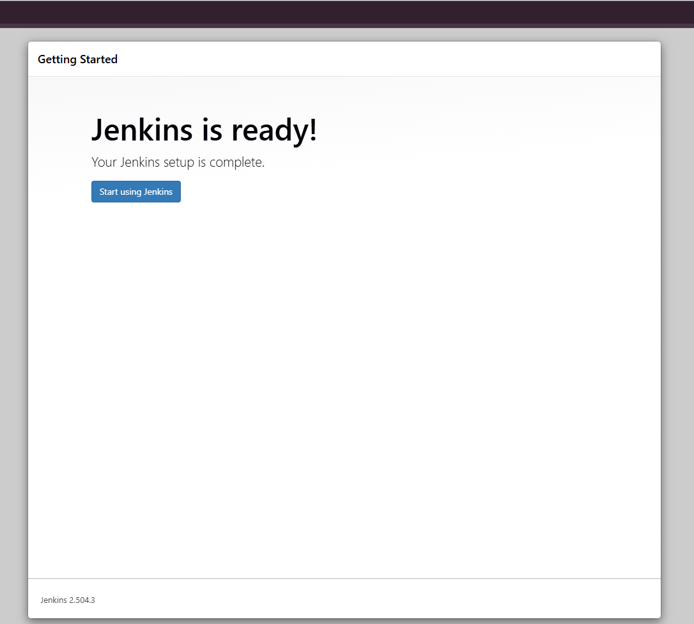
</p>

2. ✅ EC2 Instance Details  
<p align="center">
  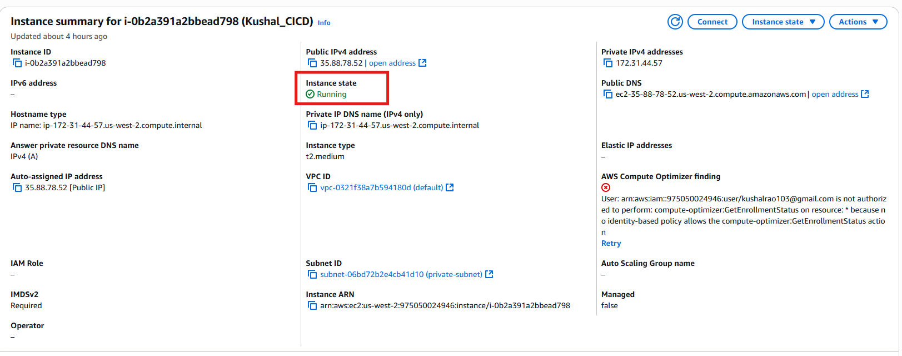
</p>

3. ✅ Jenkins Plugin Installation  
<p align="center">
  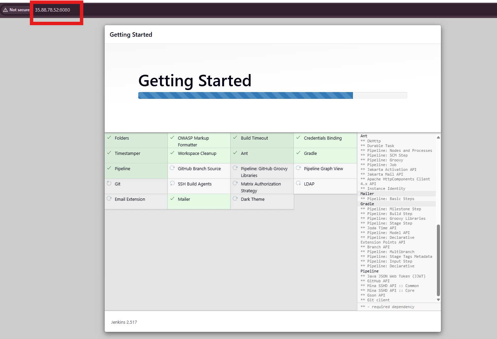
</p>

4. ✅ Jenkins Job Config (Trigger, Repo)
<p align="center">
  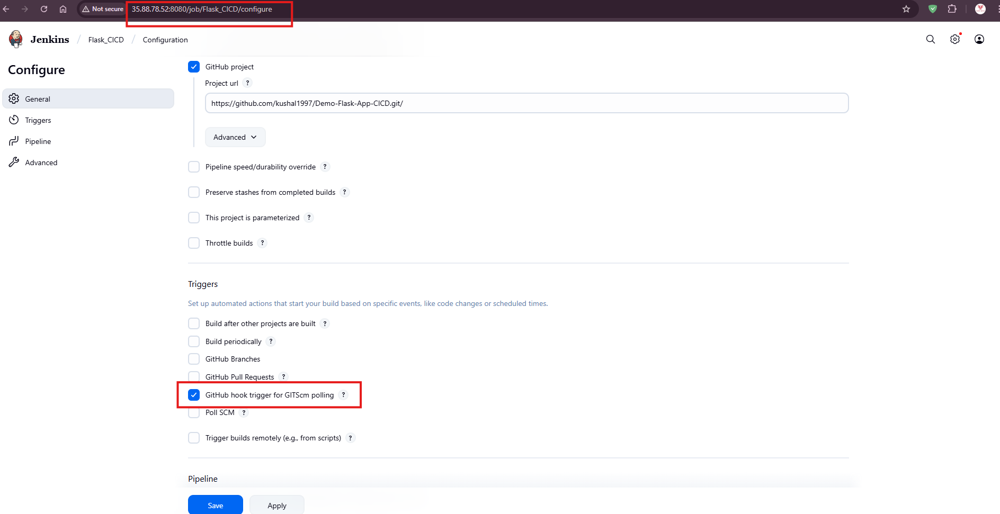
</p>

5. ✅ Jenkins Dasboard
<p align="center">
  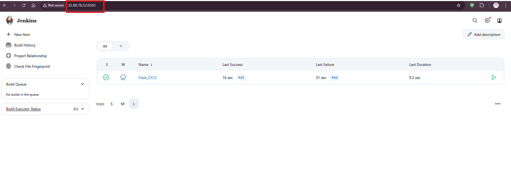
</p>

6. ✅ Pipeline Running Stages (Build → Test → Deploy)  
<p align="center">
  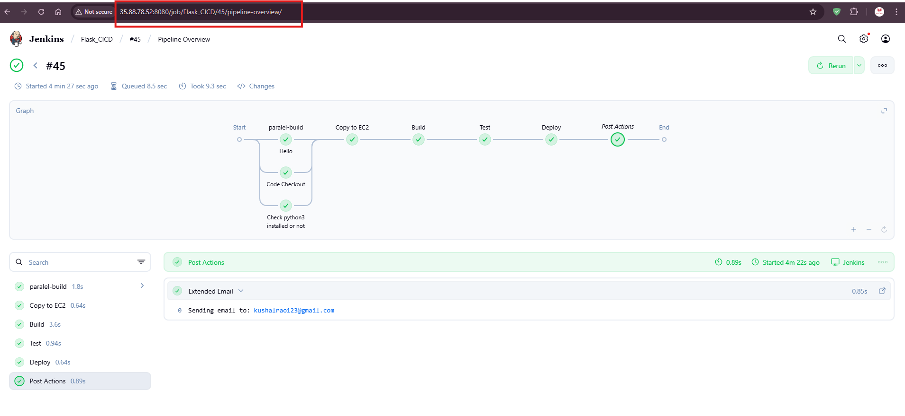
</p>

7. ✅ Flask App Running in Browser
<p align="center">
  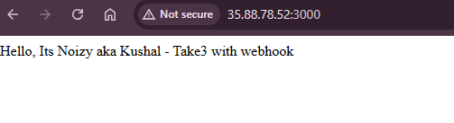
</p>

8. ✅ GitHub Webhook Settings
<p align="center">
  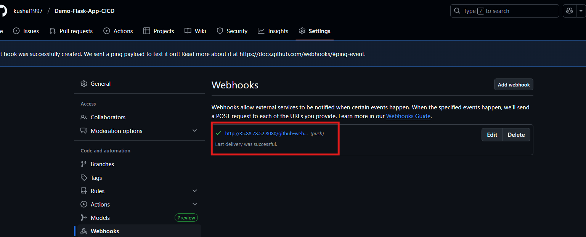
</p>

9. ✅ Jenkins Auto Start Build After Any `push`
<p align="center">
  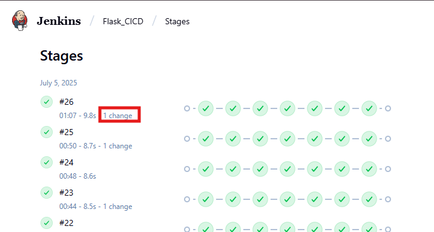
</p>

10. ✅ Success Email Notification Received 
<p align="center">
  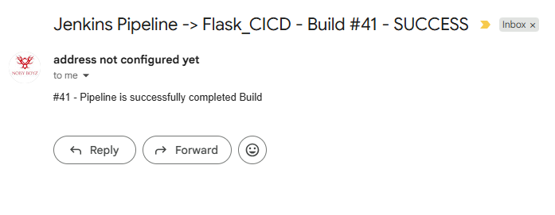
</p>

11. ✅ Failed Email Notification Received  
<p align="center">
  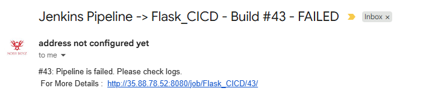
</p>

---

## ⚠️ Challenges Faced

### 1. Jenkins on t3.micro EC2
   - Initially used a `t3.micro` EC2 instance which lacked enough memory for Jenkins and caused slow performance.
   - **Solution:** Switched to a `t2.medium` instance for smoother operation.

### 2. SSH Authentication Errors
   - Faced issues using Jenkins to connect to EC2 via SSH.
   - Solution: Added EC2 key pair as Jenkins credentials (`jenkins_ec2_ssh_key`) and verified known_hosts setup using `StrictHostKeyChecking=no`.

### 3. Flask Port Already in Use
   - Got `Address already in use - port 3000` when re-deploying.
   - Solution: Added `fuser -k 3000/tcp` to kill previous processes before deploying.

###  4. Email Notification Errors
   - Jenkins post-build email failed due to:
      - Use of `${BUILD_LOG}` (which doesn’t exist)
      - Wrong function `emailtext` instead of `emailext`
   - Solution: Removed `${BUILD_LOG}` and used `emailext` with attachment support and manual `console.log` file generation.

###  5. GitHub Webhook Not Triggering Build
- Pipeline didn’t auto-trigger on GitHub push.
- Solution:
   - Installed GitHub plugin
   - Enabled “GitHub hook trigger” in Jenkins job config
   - Added webhook in GitHub with correct Jenkins URL (`http://<EC2_IP>:8080/github-webhook/`)

---


## 👤 Author

- **U KUSHAL RAO**
- GitHub: [@kushal1997](https://github.com/kushal1997)

---

## 🚀 How to Run the Flask App (Manual)

If needed, you can SSH into EC2 and manually start it:
```bash
cd /home/ubuntu
source venv/bin/activate
python3 app.py
