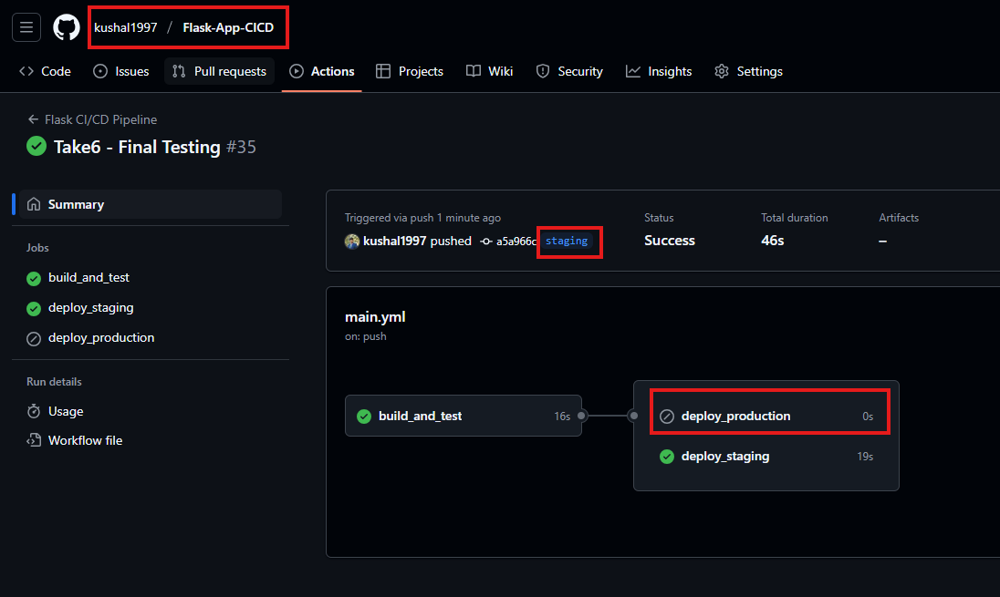
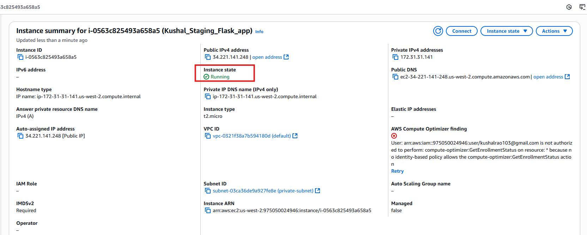
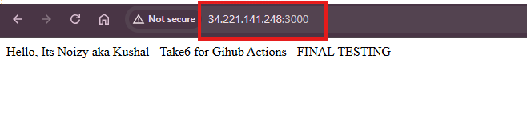
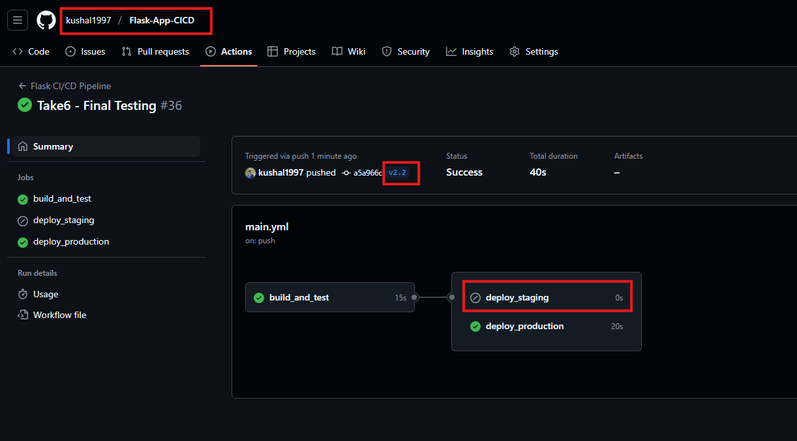
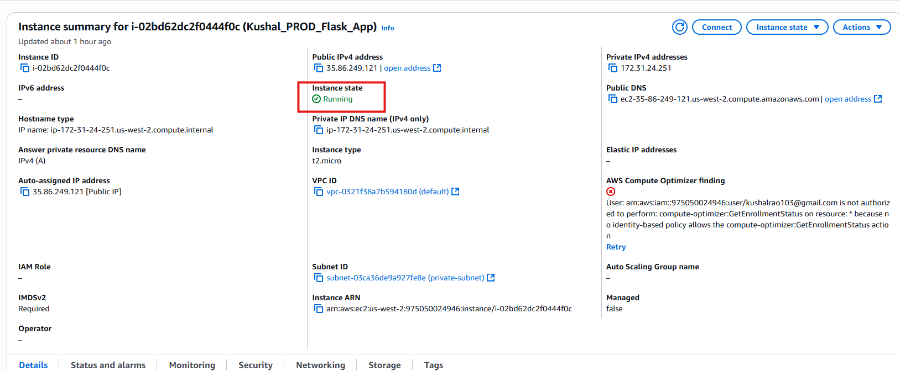
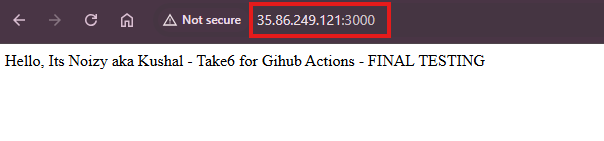
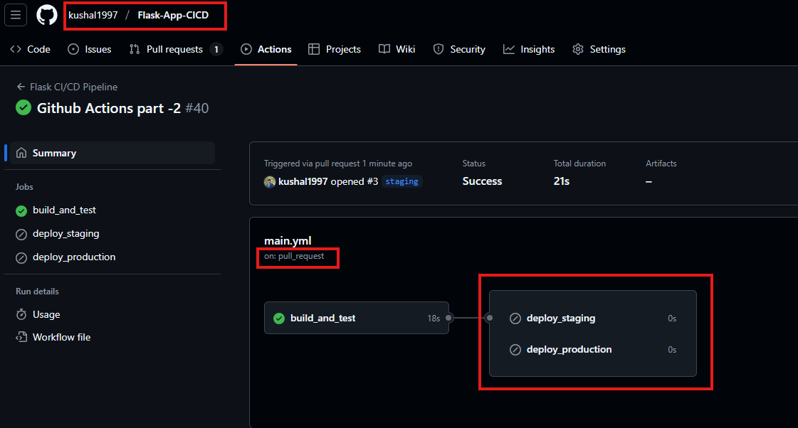

# Graded Assignment: GitHub Actions CI/CD Pipeline for Flask App

## 📘 Overview

This folder implements a complete CI/CD pipeline using GitHub Actions to automate:
   - Python dependency installation
   - Unit testing with `pytest`
   - Deployment to a staging EC2 instance on every push to `staging`
   - Deployment to a production EC2 instance when a release tag ( e.g. - `v2.1`) is pushed

---

## 🛠 Tech Stack

- **CI/CD Tool**: Github Actions
- **Language**: Python
- **Framework**: Flask
- **Testing Framework**: pytest
- **Cloud Platform**: AWS EC2
- **Source Control**: GitHub

---

## ⚙️ CI/CD Workflow Overview

The GitHub Actions workflow is defined in `.github/workflows/main.yml`.
### Trigger Conditions:

| **Event Type** | **Branch/Tag**     | **Action Triggered**                          |
|----------------|--------------------|-----------------------------------------------|
| Push           | `staging`          | Build, Test & Deploy to Staging EC2           |
| Push           | Tag `v*`       | Build, Test & Deploy to Production EC2        |
| Pull Request   | `main` or `staging`| Just Build & Test                              |

---

## 🔧 Prerequisites

Before using this CI/CD workflow, ensure the following:

- A Python Flask app is present in `2_GithubActionPipeline/` with `app.py` , `requirements.txt` and `test_app.py`
- GitHub repository contains `main`, `staging` branches
- One EC2 instance each to set up for staging & production deployment (Ubuntu)
- GitHub Secrets are configured correctly for both staging and production EC2 instances
- EC2 security group allows inbound traffic on port `3000`

---

## ✅ Jobs Breakdown

### 🧱 1. `build_and_test`
   - Checks out the code
   - Sets up Python 3.10
   - Creates virtual environment
   - Installs dependencies
   - Runs unit tests using `pytest`

### 🚀 2. `deploy_staging` (runs only on `staging` push)
   - Copies app files to staging EC2 instance
   - Installs Python, pip, venv
   - Creates virtual environment
   - Installs dependencies
   - Runs the Flask app using nohup on port `3000`

### 🚀 3. `deploy_production` (runs only on tag push like `v1.0.0`)
   - Copies app files to production EC2 instance
   - Installs Python, pip, venv
   - Creates virtual environment
   - Installs dependencies
   - Runs the Flask app using nohup on port `3000`

---

## 🔐 Secrets Used

| **Name**         | **Used For**                             |
|------------------|-------------------------------------------|
| `EC2_IP`         | Staging EC2 IP                            |
| `EC2_USERNAME`   | Staging EC2 user (usually `ubuntu`)       |
| `EC2_SSH`        | Private key for staging EC2               |
| `EC2_PATH`       | Target directory on EC2 for deployment    |
| `PROD_EC2_IP`    | Production EC2 IP                         |
| `PROD_EC2_USERNAME` | Production EC2 user                    |
| `PROD_EC2_SSH`   | Private key for production EC2            |
| `PROD_EC2_PATH`  | Target directory on production EC2        |


---

## 🚀 How to Trigger Deployment

### ▶️ Staging
   ```
      git checkout staging
      git push origin staging
   ```
### 🚀 Production
   ```
   git tag v1.0.0
   git push origin v1.0.0
   ```
---

## 🖼️ Screenshots

### ▶️ **Staging**

1. ✅ Workflow Overview
<p align="center">
  
</p>

2. ✅ EC2 Instance
<p align="center">
  
</p>

3. ✅ Browser Results
<p align="center">
  
</p>

<br>

### 🚀 **Production**

1. ✅ Workflow Overview
<p align="center">
  
</p>

2. ✅ EC2 Instance
<p align="center">
  
</p>

3. ✅ Browser Results
<p align="center">
  
</p>

<br>

### 🔄 **Pull - Event**
<p align="center">
  
</p>

---

## ⚠️ Challenges Faced

- EC2 was missing Python and pip initially, causing "command not found" errors
- GitHub Actions virtualenv required using `./venv/bin/pip` directly due to restrictions
- Needed to split installation and app-run into two separate SSH steps for better debugging
- Tag-based deploy logic required careful testing to avoid premature production deploys
- Putting restriction on jobs as 
   - For **Staging**: 
      - Will run only for `push` event in `staging` branch
      ```
         if: github.event_name == 'push' && github.ref == 'refs/heads/staging'
      ```
   - For **Production**: 
      - Will run only for `push` event with tag (e.g. - `v1.0.0`) released
      ```
         if: github.event_name == 'push' && startsWith(github.ref, 'refs/tags/')
      ```
- Need to change `master` to `main` branch
     - From browser went to all branched and changed the branch name
     - In locally:
          ```
            git branch -m master main
            git fetch origin
            git branch -u origin/main main
            git remote set-head origin -a

          ```

---


## 👤 Author

- **U KUSHAL RAO**
- GitHub: [@kushal1997](https://github.com/kushal1997)

---

## 🚀 How to Run the Flask App (Manual)

If needed, you can SSH into EC2 and manually start it:
```bash
cd /home/ubuntu
source venv/bin/activate
python app.py
```

<br>

---
